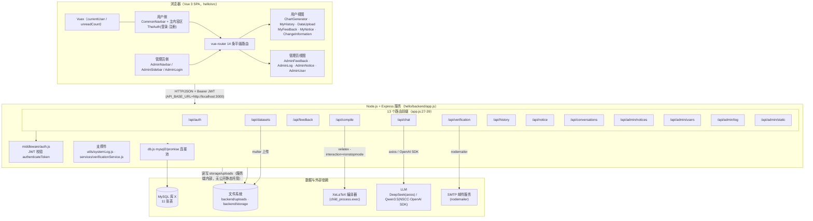
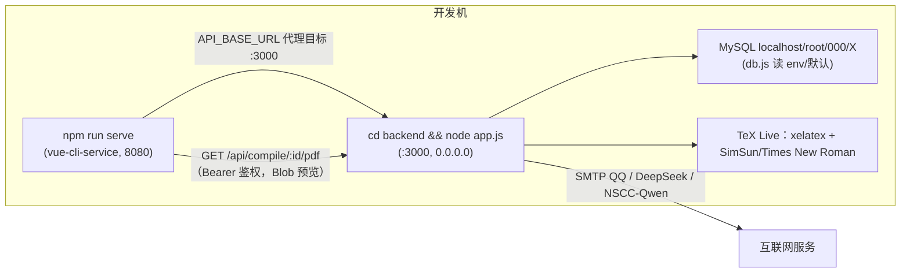
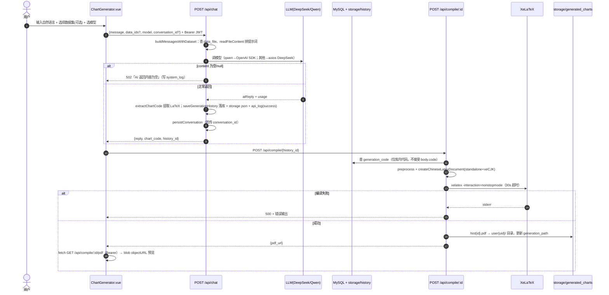
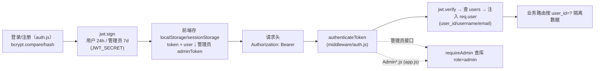
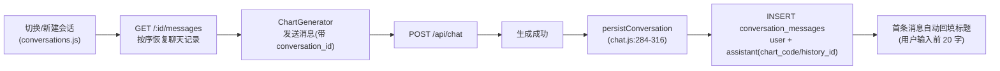
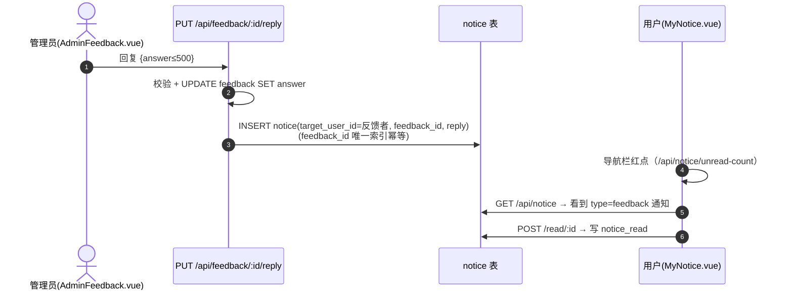
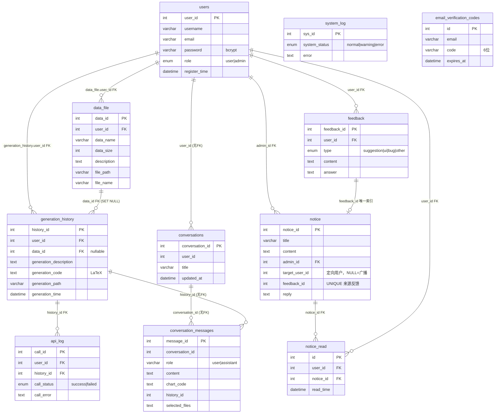

# PGFPlotsGenerator 系统架构与设计文档

> **文档说明**：本文档为 **PGFPlotsGenerator 智能图表生成系统** 的架构视图文档，聚焦**系统架构、核心模块与关键数据流**。内容基于 `2026-09-05` 对 `hello/` 目录下实际源码的逐文件核实，所有结论均可追溯到代码行号。与 `README.md`（API/部署细节）互补，两者不一致处见文末「与 README 差异清单」。

## 1. 系统概述

PGFPlotsGenerator 是一个「AI 图表生成系统」：普通用户用自然语言描述图表需求（可附带 Excel/CSV/文本数据集），后端调用大语言模型生成 LaTeX/PGFPlots 代码，再通过 XeLaTeX 编译为 PDF 供在线预览与下载；全过程持久化到 MySQL 与本地文件系统，支持历史回溯、多轮对话、数据文件管理与反馈通知。管理员通过独立后台管理用户、通知与系统监控。

- **产品定位**：自然语言 → 图表 PDF 的一站式生成工具
- **用户角色**：普通用户（生成/历史/数据集/对话/反馈/通知/个人信息）与管理员（用户、通知、反馈回复、系统日志/API 统计）
- **核心链路**：`自然语言(±数据集) → AI 生成 LaTeX → XeLaTeX 编译 → PDF 预览/下载`

## 2. 总体架构

系统为**前后端分离的经典分层架构**：浏览器端 Vue 3 SPA（`hello/src`），服务端 Express 应用（`hello/backend`），数据层为 MySQL（库名 `X`）+ 本地文件系统，外部依赖为两家 LLM 服务、XeLaTeX 编译器与 SMTP 邮件服务。

### 2.1 逻辑架构



### 2.2 运行/部署视角



## 3. 核心模块说明

### 3.1 模块总览

| 模块 | 后端入口 | 前端对应 | 职责与关键实现 |
|---|---|---|---|
| 认证 | `backend/routes/auth.js` | LoginForm / RegisterForm / AdminLogin / ChangeInformation | 注册、用户/管理员登录、改密码/用户名/邮箱、token 校验；bcrypt 哈希 + JWT |
| AI 生成 | `backend/routes/chat.js` | ChartGenerator | 接收自然语言+数据集 → 拼提示词 → 调 DeepSeek/Qwen → 提取代码 → 落库 |
| 编译 | `backend/routes/compile.js` | ChartGenerator（生成 PDF 按钮） | 读库内代码 → 包中文文档 → XeLaTeX → 移动 PDF、更新路径 |
| 历史 | `backend/routes/history.js` | MyHistory | 列表/详情/删除/统计/CSV 导出 |
| 数据集 | `backend/routes/datasets.js` | DataUpload / ChartGenerator | multer 上传(≤100MB)/列表/改名/删除/下载 |
| 对话持久化 | `backend/routes/conversations.js` | ChartGenerator（会话侧栏） | 会话 CRUD + 消息读取；chat 生成时联动写消息 |
| 反馈 | `backend/routes/feedback.js` | MyFeedback / AdminFeedback | 用户提交查看；管理员列表/详情/回复(联动写通知)/删除 |
| 通知 | `backend/routes/notice.js` | MyNotice / CommonNavbar | 系统通知+反馈回复统一列表；单条/全部已读；未读计数 |
| 邮件验证码 | `backend/routes/verification.js` + `services/verificationService.js` | RegisterForm / ChangeInformation | 发送/校验注册·改邮箱验证码 |
| 管理员-用户 | `backend/routes/AdminUser.js` | AdminUser | 用户列表/重置密码(666666)/级联删除/统计 |
| 管理员-通知 | `backend/routes/AdminNotice.js` | AdminNotice | 通知 CRUD（广播）+ 已读统计 |
| 管理员-日志 | `backend/routes/AdminLog.js` | AdminLog | API 统计/系统日志/健康概览/表状态 |
| 管理员-概览 | `backend/routes/AdminStatic.js` | Admin（Admin.vue 首页） | 全库计数（users/files/generations/feedback） |

> 后端入口统一挂载于 `backend/app.js:27-39`。业务接口除验证码外均需 `Authorization: Bearer <token>`。

### 3.2 各模块详细说明

#### 3.2.1 认证（auth）

- 入口：`backend/routes/auth.js`
- 接口：`POST /admin/login`(:21)、`POST /register`(:97)、`POST /login`(:196)、`POST /change-password`(:262)、`POST /change-username`(:340)、`POST /change-email`(:440)、`GET /validate`(:544)
- 关键逻辑：
  - 密码统一 `bcryptjs.hash(pwd, 10)` 存储、`bcrypt.compare` 校验（如 `auth.js:150,296`）
  - 密码格式校验 `validatePassword`：**仅字母与数字、长度 6–16 位**（`auth.js` 顶部，注册/改密共用）
  - JWT 签发：管理员 token 7 天（`auth.js:60-69`，payload 含 userId），用户 token 24h（`auth.js:164-168, 232-236`）
- 鉴权校验在 `backend/middleware/auth.js:7-38`：取 `Authorization: Bearer` → `jwt.verify`（密钥来自 `process.env.JWT_SECRET`）→ 按 `decoded.userId` 查 `users` 表 → 注入 `req.user`（仅 user_id/username/email，**不含 role**）

> 角色判断注意：`authenticateToken` 不回填 role。管理员接口统一为 `feedback.js` 内部自定义 `checkAdmin`（查库校验 role=admin，`feedback.js:10-42`）与 `app.js` 对四个 `/api/admin/*` 前缀统一挂载的 `authenticateToken + requireAdmin`（middleware/auth.js，同样查库校验 role）两种实现，均不信任 JWT payload 中的角色声明。

#### 3.2.2 AI 生成（chat）

- 入口：`backend/routes/chat.js`，单路由 `POST /`（:319-521，需认证）
- 处理流水线：
  1. `buildMessagesWithDataset(userMessage, dataIds, userId)`（:96-167）：从 `data_file` 按 `data_id IN (?) AND user_id = ?` 查询（:131-137），逐一用 `readFileContent`（:16-77，支持 xlsx/csv/文本，上限 100MB）把数据拼入 system 提示词；无数据集时追加提示「用已知公开统计数据出图」
  2. 按 `model` 分派（:340-430）：
     - `model === 'qwen'`：OpenAI SDK 指向 `NSCC_API_URL`（湖大超算 MaaS），模型 `Qwen3.5`，`max_tokens: 8192`、关闭 thinking（:352-365）
     - 否则（deepseek）：axios POST `DEEPSEEK_API_URL`，模型 `deepseek-v4-flash`，`max_tokens: 4096`，超时 30s（:398-414）
  3. **空回复兜底**：`content` 为 null/空/非字符串时打印原始响应、写系统日志并返回 `502「AI 返回内容为空」`（Qwen :372-384 / DeepSeek :421-429）
  4. `extractChartCode(aiReply)`（:80-93）：优先匹配「```latex / ```tex 代码块围栏」，兜底裸 `\begin{tikzpicture}...\end{tikzpicture}`（防截断围栏不闭合）；返回值即入库代码
  5. `saveGenerationHistory`（:170-281）：INSERT `generation_history` → 写 `storage/history/{userId}/{historyId}.json`（含 ai_response 全文）→ INSERT `api_log`(success)
  6. 若请求带 `conversation_id`：`persistConversation`（:284-316）写 user/assistant 两条 `conversation_messages`（assistant 消息带 chart_code/history_id），首条自动回填标题
  7. 失败路径：模型异常时记录 `api_log`(failed, call_error 截断 500) 并按错误类型返回（:476-519）
- 返回结构 `{ success, data: { reply, chart_code, usage, dataset_count, history_id } }`

#### 3.2.3 编译（compile）

- 入口：`backend/routes/compile.js`
- 接口：`GET /:history_id/pdf`（鉴权流式返回 PDF 文件）、`POST /:history_id`（编译，均需认证）
- 关键事实：
  - **POST 只读取库内 `generation_history.generation_code`**（:132），**不接受请求体 code 覆盖**；先校验历史存在且属于当前用户（:93-110）
  - `preprocessLatexCode`（:208-233）：若代码含完整 `document` 结构则抽取文档体并清理 documentclass/usepackage
  - `createChineseLatexDocument`（:236-255）：用 `standalone` 文档类 + `pgfplots/compat=1.18` + `xeCJK`，**中文字体 SimSun、西文 Times New Roman**
  - `compileLatexWithXeLaTeX`（:258-289）：`xelatex -interaction=nonstopmode`，超时 **30s**；以 PDF 是否存在判成败
  - 成功：PDF 移动至 `storage/generated_charts/user{userId}/hist{historyId}.pdf`，更新 `generation_path`（相对路径，:171-178）；失败走 `safeCleanup` 清理临时目录（:292-317）
- PDF 访问：已移除 `/storage` 无鉴权静态托管；前端通过 `GET /api/compile/:id/pdf` 携带 JWT，服务端按 `user_id` 校验归属后 `res.sendFile` 流式返回，前端 `fetch → blob → objectURL` 预览（`src/utils/pdf.js`）

#### 3.2.4 历史（history）

- 接口：`GET /`（列表+分页/搜索，:107）、`GET /:id`（:168）、`DELETE /:id`（:240）、`GET /stats/summary`（:307）、`GET /export/csv`（:368）
- 删除使用**事务**：先删 `api_log` 子表再删 `generation_history`（:253-292）；所有查询均带 `user_id = ?` 隔离

#### 3.2.5 数据集（datasets）

- 接口：`GET /`（:47）、`POST /`（:96，multer `single('file')`）、`POST /:id/update`（:174）、`DELETE /:id`（:262）、`GET /download/:id`（:310）
- multer 配置：磁盘存储到 `uploads/`（相对路径，:13-35），**≤100MB**
- 文件预览无独立后端接口：`readFileContent` 仅定义于 `chat.js`（:16-77），前端从数据集列表直接拿到文件元信息，聊天发送时交后端解析

#### 3.2.6 对话持久化（conversations）

- 接口：`GET /`（:10-41，含 message_count/last_message）、`POST /`（:44-60，默认标题「新对话」）、`PUT /:id`（:63-80 重命名）、`DELETE /:id`（:83-116，**事务先删消息再删会话**）、`GET /:id/messages`（:119-149，按 message_id 正序返回 content/chart_code/history_id/selected_files）
- 写入方：`chat.js:persistConversation`（:284-316）在生成成功后写入一轮 user+assistant 消息
- 表：`conversations` / `conversation_messages`（无外键，关联由代码事务维护）

#### 3.2.7 反馈（feedback）

- 用户接口：`POST /`（:45-98，type ∈ suggestion/ui/bug/other，content ≤100）、`GET /user/my-feedbacks`（:101-158，含「已回复/待回复」状态）
- 管理员接口（`authenticateToken + checkAdmin`）：`GET /`（:161-235，筛选 type/日期）、`GET /:id`（:238-271）、`PUT /:id/reply`（:274-369）、`DELETE /:id`（:372-403）
- **回复→通知联动**（:327-353）：更新 `feedback.answer` 后，INSERT 一条定向 `notice`（target_user_id=反馈者、feedback_id 关联、reply=回复内容；`feedback_id` 唯一索引保证幂等）

#### 3.2.8 通知（notice）

- 接口：`GET /`（:10，返回列表+unreadCount）、`POST /read/:id`（:70，写 `notice_read`）、`POST /read-all`（:92）、`GET /unread-count`（:112）
- 通知来源两类，统一走 `notice` + `notice_read`：
  - 系统广播：`AdminNotice` 创建，`target_user_id = NULL`
  - 反馈回复：`feedback.js` 回复时写入，`target_user_id = 反馈者`
- 前端未读数红点由 `store/index.js:56-70` 的 `fetchUnreadCount` 拉取

#### 3.2.9 邮件验证码（verification）

- 接口：`POST /send-register-code`（verification.js:7）、`POST /verify-register-code`（:56），**均免 token**
- `services/verificationService.js`：生成 6 位随机码（:39-46）、SMTP 发送（nodemailer，:49-60）、落 `email_verification_codes`（10 分钟过期、一次性）
- 注册与改邮箱前校验（auth.js:97 register / :440 change-email）

#### 3.2.10 管理员后台（Admin*，app.js 统一挂 `authenticateToken + requireAdmin`）

| 模块 | 主要接口 | 备注 |
|---|---|---|
| AdminUser.js | `GET /`(:20)、`PATCH /:id/reset-password`(:77，重置为 `666666`，bcrypt 哈希)、`DELETE /:id`(:119，级联删除关联数据)、`GET /statistics/overview`(:216) | 无 JWT 中间件 |
| AdminNotice.js | `GET /`(:8)、`GET /:id`(:105)、`POST /`(:143)、`PUT /:id`(:182)、`DELETE /:id`(:231)、`DELETE /`(:268 批量)、`GET /statistics/overview`(:299) | 广播通知 |
| AdminLog.js | `GET /api-stats`(:32)、`GET /system-logs`(:142)、`GET /health-overview`(:268)、`POST /add-test-log`(:362)、`GET /tables-status`(:393) | — |
| AdminStatic.js | `GET /`(:8，全库计数) | — |

### 3.3 支撑件

| 文件 | 职责 |
|---|---|
| `backend/db.js` | `mysql2/promise` 连接池，读取 `.env` 的 `DB_HOST/DB_USER/DB_PASSWORD/DB_NAME`（缺省回退 `localhost/root/000/X`）、connectionLimit 10，导出 `{ promisePool }` |
| `backend/middleware/auth.js` | JWT 校验中间件（见 3.2.1） |
| `backend/utils/systemLog.js` | `writeSystemLog(status, message)` 写 `system_log`（error 截断 500 字；自身失败仅 console，不抛异常，:12-22） |
| `backend/services/verificationService.js` | 验证码生成/发信/落库 |

### 3.4 前端路由与视图（前后端映射）

路由定义于 `src/router/index.js`，**14 条平级路由、无嵌套布局、无全局路由守卫**（无 `beforeEach`）：

| 路由 | 组件 | 后端依赖 | 说明 |
|---|---|---|---|
| `/` | — | — | 动态重定向：有 `adminUser` → `/admin`，否则 `/chart-generator` |
| `/chart-generator` | ChartGenerator | `/api/chat` `/api/compile/:id` `/api/conversations*` `/api/datasets` | 核心对话页：模型切换（qwen 默认/deepseek）、选数据集、生成→编译→PDF 预览 |
| `/history` | MyHistory | `/api/history*` | 历史列表/详情/删除/导出 CSV |
| `/data-upload` | DataUpload | `/api/datasets` | 数据集上传/管理 |
| `/feedback` | MyFeedback | `/api/feedback` | 我的反馈 |
| `/MyNotice` | MyNotice | `/api/notice` | 我的通知 |
| `/change-information` | ChangeInformation | `/api/auth` + `/api/verification` | 改密码/用户名/邮箱 |
| `/login` / `/register` | LoginForm / RegisterForm | `/api/auth` + `/api/verification` | 认证（TheAuth 容器切换） |
| `/admin` | Admin.vue | `/api/admin/static` | 管理员概览首页 |
| `/admin/user` | AdminUser | `/api/admin/users` | 用户管理 |
| `/admin/notice` | AdminNotice | `/api/admin/notices` | 通知管理 |
| `/admin/feedback` | AdminFeedback | `/api/feedback`（管理员） | 反馈管理 |
| `/admin/log` | AdminLog | `/api/admin/log` | 系统监控 |

- 布局：`App.vue` 依状态渲染——未登录显示 `TheAuth`；普通用户显示 `CommonNavbar` + 主区；管理员显示 `AdminNavbar` + `AdminSidebar` + 路由视图（`App.vue:22-65`）；管理员认证状态存 `localStorage.adminUser/adminToken`，非 Vuex
- 状态管理：`store/index.js`（Vuex）——`currentUser/isAuthenticated/unreadCount`；axios **无统一实例与响应拦截器**，各组件自行拼 `Authorization` 头（如 `ChartGenerator.vue:883-890`）；`API_BASE_URL` 定义于 `src/config.js:2`（默认 `http://localhost:3000`）
- 未读数：进入 MyNotice 时经 store action 拉 `/api/notice/unread-count`（`App.vue:107-110, 222-224`）

## 4. 关键数据流

### 4.1 生成 → 编译 → 预览 主链路



### 4.2 鉴权数据流



### 4.3 对话持久化数据流



### 4.4 反馈 → 通知联动



### 4.5 文件路径约定

| 路径 | 内容 | 写入方 |
|---|---|---|
| `backend/uploads/` | 数据集原始文件（multer diskStorage） | datasets.js:13-35 |
| `backend/storage/history/{userId}/{historyId}.json` | 完整对话/生成记录（含 ai_response） | chat.js:228-254 |
| `backend/storage/generated_charts/user{userId}/hist{historyId}.pdf` | 编译产物（`generation_path` 相对项目根） | compile.js:159-178 |
| `GET /api/compile/:id/pdf` | PDF 鉴权流式返回（按 user_id 归属校验） | compile.js |

## 5. 数据存储设计

### 5.1 ER 图



### 5.2 表与建表来源

库名 `X`，共 **11 张表**：

| 表 | 关键列 | 来源 | 备注 |
|---|---|---|---|
| `users` | user_id/username/email/password/role | `1.sql:5-12` | 预置管理员 `admin123/666666`（`1.sql:14-20`） |
| `data_file` | data_id/user_id/data_name/data_size/file_path/... | `1.sql:22-34` | user_id FK ON DELETE CASCADE |
| `generation_history` | history_id/user_id/data_id/generation_code/generation_path | `1.sql:36-46` | data_id FK SET NULL |
| `api_log` | call_id/user_id/history_id/call_status/call_error | `1.sql:48-57` | 关联历史 |
| `feedback` | feedback_id/user_id/type/content/answer/answer_time | `1.sql:59-68` | — |
| `system_log` | sys_id/system_status/error | `1.sql:70-75` | writeSystemLog 写入 |
| `email_verification_codes` | email/code/expires_at | `1.sql:77-85` | 10 分钟过期 |
| `notice` | notice_id/title/content/admin_id + **target_user_id/feedback_id/feedback_time/feedback_type/reply** | `1.sql:87-95` + `migrations/add_notice_feedback_columns.sql` | 后 5 列迁移追加；`feedback_id` 唯一索引 |
| `notice_read` | id/user_id/notice_id/read_time | `migrations/create_notice_read_table.sql:8-17` | user+notice 唯一索引 |
| `conversations` | conversation_id/user_id/title/created_at/updated_at | `backend/migrations/001_conversations.js:8-16` | **无外键**，事务维护 |
| `conversation_messages` | message_id/conversation_id/user_id/role/content/chart_code/history_id/selected_files | `backend/migrations/001_conversations.js:19-31` | **无外键** |

> 实现事实：基础表部分外键在 DDL 中声明；`conversations`/`conversation_messages` 之间及与历史/用户之间**不设外键**，会话删除由 `conversations.js:83-116` 在事务内先删消息再删会话。

### 5.3 建表/迁移执行顺序

```bash
mysql -u root -p000 X < 1.sql
mysql -u root -p000 X < migrations/add_notice_feedback_columns.sql
mysql -u root -p000 X < migrations/create_notice_read_table.sql
node backend/migrations/001_conversations.js   # 需在 backend/ 目录执行（依赖 db.js）
```

## 6. 技术栈清单

| 层 | 技术 | 依据 |
|---|---|---|
| 前端框架 | Vue `^3.2.13`（Composition API 与 Option API 混用）+ Vue Router `^4.6.3` + Vuex `^4.0.2` | `hello/package.json` |
| UI | Element Plus `^2.11.9` + `@element-plus/icons-vue`；监控页 ECharts `^6.0.0` | 同上 |
| 构建 | **Vue CLI 5**（`vue-cli-service serve/build`，非 Vite） | `hello/package.json` scripts、`vue.config.js` |
| HTTP | axios（组件内直调，无统一封装）；部分 fetch | `ChartGenerator.vue:434` 等 |
| 后端框架 | Express `^4.18.2`（backend/package.json，包名 `my-google-style-app`） | `backend/package.json:25` |
| 数据库 | mysql2 `^3.15.3`（promise 连接池）+ mysql `^2.18.1` | `backend/db.js` |
| LLM 调用 | openai `^6.42.0`（Qwen3.5/NSCC）、axios（DeepSeek `deepseek-v4-flash`） | `chat.js:352,398` |
| 编译 | child_process.exec 调 **xelatex**（TeX Live + SimSun/Times New Roman 字体） | `compile.js:258-289` |
| 邮件 | nodemailer `^7.0.11`（QQ SMTP） | `verificationService.js` |
| 上传/解析 | multer（cors、multer 未声明于 backend/package.json，依赖 node_modules）、xlsx `^0.18.5` | `datasets.js:4` |
| 安全 | bcryptjs `^3.0.3` / bcrypt、jsonwebtoken `^9.0.2` | `auth.js:4-5` |

> 前后端位于同一工程 `hello/`：根 `package.json` 为前端依赖，`backend/package.json` 为后端依赖（另有根依赖含 express `^5.1.0`、playwright 等，后端实际运行以 `backend/` 为准）。

## 7. 与 README.md 差异清单（2026-09-05 复核）

> README v2.0 基准日期 2026-07-16。以下差异以代码为准。

| # | 主题 | README/plan 声称 | 代码实证（本文件基准） |
|---|---|---|---|
| 1 | 后端路由数量 | 多处称「**14 个**路由前缀/模块」（README §1/§5/§7/§11#8） | **实际 13 个前缀**（app.js:27-39），routes/ 下 13 个 js；无 `/api/user` 等额外前缀 |
| 2 | `notice` 表 `is_read` 字段 | §8 表未提 | `1.sql:92` 存在 `is_read BOOLEAN`（旧机制字段），迁移引入 `notice_read` 后实际按每用户已读记录工作，README 未明确该字段废弃状态 |
| 3 | plan「后端待实现」· 改码重编译 | 期望 `POST /api/compile` 接受 `{history_id, code}` 覆盖 | 未实现：compile.js 仅读库内 `generation_code`（:132）；前端编译请求 body 为空（`ChartGenerator.vue:986`） |
| 4 | plan「后端待实现」· AI 修复 | 期望 `POST /api/chat/fix` | 未实现：chat.js 无该路由（仅 `POST /`）；前端无对应调用 |
| 5 | plan「前端已做」改码重编译 | 声称前端「编辑代码→重编译」已做 | ChartGenerator 消息代码区未见编辑入口；编译仅对 `message.historyId` 发起（:986） |
| 6 | 空气泡修复 | plan.md 记为待实施 | **已落地**：chat.js:372-384 / :421-429 对空 content 返回 502 + 写系统日志；前端 `ChartGenerator.vue:932-935` 渲染明确错误消息 |
| 7 | 无数据集出图 | plan 契约 | **已落地**：buildMessagesWithDataset 无数据集分支提示用公开数据出图（chat.js:121-124、system 提示词 :113） |
| 8 | `readFileContent` 归属 | README §4 数据集行文字「readFileContent 在此文件内定义」 | 实际仅定义于 `chat.js:16-77`，datasets.js 无该函数；文件预览无后端独立接口 |
| 9 | 前端路由数 | （README 未列路由明细） | router 实际 **14 条记录**（含 `/` redirect），13 个页面组件；无路由守卫，鉴权由 App.vue 条件渲染 + 后端 JWT 兜底 |
| 10 | 依赖声明 | README 称 cors/multer 未声明于 backend/package.json | 仍属实：backend/package.json 无 cors/multer（运行时依赖已装 node_modules），部署需注意 |

## 8. 安全与可运维性提示（2026-09-07 已加固，下述为当前状态与运维注意）

- ✅ `/api/admin/*` 四个模块（AdminUser/AdminNotice/AdminLog/AdminStatic）由 `app.js` 统一挂 `authenticateToken + requireAdmin`（middleware/auth.js，查库校验 role=admin）；feedback 管理员接口保留 `authenticateToken + checkAdmin` 双校验；均为服务端强制鉴权，不再依赖前端隐藏
- ✅ PDF 已移除 `/storage` 静态托管与 `/storage` 反代，改 `GET /api/compile/:id/pdf` 按 user_id 归属校验后 `res.sendFile`（history JSON 目录不再可被 HTTP 访问）
- ✅ LaTeX 编译前 `validateLatexCode` 拦截 `\write18`/`\input`/`\include`/`\usepackage` 等危险序列并限制长度
- ✅ `backend/db.js` 凭据改读 `.env`（缺省回退本地默认值）；JWT 去除 `'your-secret-key'` 兜底，`app.js` 启动时校验 `JWT_SECRET` 缺失即退出
- ✅ 密码规则收紧为仅字母数字 6–16 位（`auth.js` `validatePassword`），预置管理员 `admin123/666666` 与重置密码均满足
- ⚠️ 运维注意：`backend/.env` 明文含 SMTP 授权码与两家 LLM API Key，须加入 `.gitignore` 且勿提交；`1.sql` 预置管理员哈希未经明文验证（重置密码统一 `666666` 见 `AdminUser.js:96`）
- 系统日志与 API 日志分离：`system_log` 记录服务端异常/越权告警，`api_log` 记录每次 AI 调用成败

## 9. 参考文档

| 文档 | 说明 |
|---|---|
| `hello/README.md` | 项目文档 v2.0（模块/API/部署细节，差异见 §7） |
| `hello/plan.md` | 优化功能清单（部分契约未落地，见 §7#3-5） |
| `hello/log.md` | 开发日志 |
| `hello/1.sql`、`hello/migrations/`、`hello/backend/migrations/001_conversations.js` | 数据库 schema 与迁移 |

---
**文档版本**：1.1（架构视图）
**基准日期**：2026-09-07
**基准**：`hello/` 下源码实证（行号引用如上）
