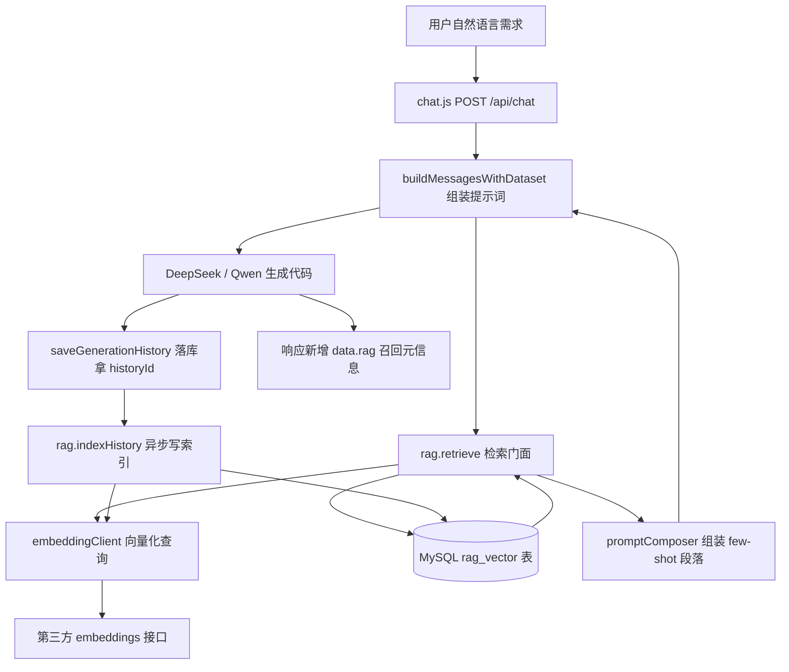

## 产品概述

在现有 PGFPlotsGenerator（Vue3 前端 + Node.js/Express 后端 + MySQL + DeepSeek/Qwen 调用 + XeLaTeX 编译）上增加**向量 RAG 检索增强能力**，服务于「AI 生成 PGFPlots 图表代码」这一核心链路。改造目标是让项目拥有一个**能逐行讲透的 RAG 亮点**，用于 Java 后端实习面试，同时**不更换技术栈、不重写 Java、不引入 LangChain.js**，现有系统保持可运行、可交付。

## 核心功能

- **历史图表代码 few-shot 检索**：把用户历史生成的「自然语言需求 + 图表代码」向量化建索引，生成新图时按语义召回相似案例，作为少样本范例。
- **PGFPlots 模板库检索**：把系统提示词中的进阶图型模板（柱状/折线/饼图/散点/堆叠柱/密集柱状缩写/误差棒等）抽取成模板库并向量化，按需求召回最相关的模板片段。
- **生成前检索注入**：在调用大模型前，把召回的 top-k 范例注入提示词，且显式声明为「仅参考图型写法与结构、禁止照搬数据」，与既有【上下文独立指令】共存不冲突。
- **生成后自动索引**：每次生成成功后，异步把本次需求与代码写入向量索引，索引持续增长。
- **失败静默降级**：embedding 未配置、超时或报错时自动退回无 RAG 的原链路，主生成流程绝不中断；提供 RAG 开关与超时配置。
- **用户数据隔离**：历史检索严格按 user_id 过滤，模板库全局共享。
- **可量化召回演示**：提供脚本输入自然语言查询并打印 top-k 召回结果与相似度得分，作为检索效果的验证与面试演示依据。

## 视觉与交互

本次为纯后端能力改造，界面保持现状；仅在 AI 生成响应中额外返回本次召回数量等元信息（如「参考了 N 个相似案例」），供前端可选展示，不做界面改版。

## 技术栈

- **后端**：Node.js + Express 4（沿用，不换语言、不重写）
- **向量化**：第三方 OpenAI 兼容 `/v1/embeddings` 接口，默认 SiliconFlow `BAAI/bge-m3`（1024 维），可配置切换阿里百炼 `text-embedding-v4`；**复用已安装的 `openai@^6.42.0` SDK**（`client.embeddings.create`），不新增框架依赖
- **向量存储**：MySQL InnoDB 新建 `rag_vector` 表，向量以 JSON 数组文本存 LONGTEXT，附 `dim` / `model` 字段做一致性校验
- **检索算法**：Node 端**暴力余弦相似度**（全量加载 → 点积归一化 → top-k 排序），数百至数千条规模下单次检索毫秒级；面试中说明「数据量上万再演进 ANN/HNSW 或专用向量库」
- **明确不引入 LangChain.js**

## 实现方案

### 总体策略

在 `backend/services/rag/` 下新增一个自包含的 RAG 模块（embedding 客户端 / 向量存取 / 检索器 / 提示词组装器），对外暴露 `retrieve()` 与 `indexHistory()` 两个门面方法。`chat.js` 只在两处接入：**生成前**在 `buildMessagesWithDataset` 返回前检索并注入 few-shot；**生成成功后**在 `saveGenerationHistory` 拿到 `historyId` 后异步写索引。所有 RAG 调用包裹在 try/catch 中，失败即静默降级为原始链路。

### 关键决策与取舍

- **为什么复用 openai SDK 而不引 LangChain.js**：本项目 RAG 只需「向量化 + 余弦检索 + 提示词拼接」三步，约百行即可完成；引入 LangChain 会带来依赖膨胀与版本破坏性升级风险，且面试被追问底层实现时黑盒调用更易穿帮。自研实现每一行都可解释。
- **为什么 embed「用户需求描述」而非直接 embed 代码**：检索意图应匹配**用户意图**，历史代码作为注入内容而非被检索对象，召回语义更准（面试可讲表征策略取舍）。
- **为什么向量存 MySQL 而非专用向量库**：零新增中间件、复用现有连接池与迁移范式，与项目「轻量可交付」定位一致；用 `dim`/`model` 字段规避换模型导致的向量错配。
- **为什么用暴力检索**：N 条向量 × D 维点积，单次约 N×D 次浮点运算，数千条规模远低于阈值；代价以「演进思路」形式在面试中体现，而非提前引入复杂度。

### 性能与可靠性

- 检索复杂度 O(N×D)，默认 top-k 较小（历史 3、模板 2），无性能瓶颈。
- 新增的 embedding 调用会增加约 100–300ms 前置延迟，通过可配置超时（默认 3s）与失败降级兜底。
- 注入提示词前对片段长度截断，避免挤占 token 预算（现有 system prompt 已很长）。
- 回填脚本按批次 + 并发上限执行，打印进度，避免打爆 embedding 接口。
- 索引写入失败只记 `writeSystemLog`，不影响生成结果与响应。

## 实现要点

- **严格遵守仓库既有风格**：CommonJS `require`、中文注释、参数化 SQL（`?` 占位）、表 `ENGINE=InnoDB DEFAULT CHARSET=utf8mb4`、迁移脚本范式与 `backend/migrations/001_conversations.js` 一致（`db.promisePool` + `process.exit`）。
- **零破坏原则**：不改动现有 AI 生成、代码提取、历史落库、响应结构（仅新增 `data.rag` 附加字段），不重排既有逻辑；`RAG_ENABLED=false` 时应与改造前行为完全一致。
- **数据隔离**：历史召回 SQL 必须带 `user_id = ?`；模板查询 `source_type='template'` 且 `user_id IS NULL`。
- **提示词冲突处理**：新增的 few-shot 段落需显式标注「参考范例：仅参考图型写法/代码结构，禁止照搬其数据与数值」，并说明其与【上下文独立指令】的关系（独立指令约束「不参考本会话历史」，范例是主动注入的参考资料，二者不冲突）。
- **安全**：不打印 API Key 与完整向量；日志仅记录条数、耗时、失败原因摘要。

## 架构设计



## 目录结构

```
PG/hello/
├── backend/
│   ├── routes/
│   │   └── chat.js                      # [MODIFY] 生成前检索注入 + 生成后异步写索引 + 响应扩展 data.rag
│   ├── services/
│   │   └── rag/
│   │       ├── index.js                 # [NEW] RAG 门面：retrieve / indexHistory，统一开关、超时与静默降级
│   │       ├── embeddingClient.js       # [NEW] 封装 openai SDK embeddings.create：超时、重试、维度/模型校验
│   │       ├── vectorStore.js           # [NEW] rag_vector 表读写：参数化 SQL、按 user_id 隔离、批量 upsert
│   │       ├── retriever.js             # [NEW] 暴力余弦相似度检索：top-k、阈值过滤、排序返回
│   │       └── promptComposer.js        # [NEW] 将召回片段组装为 few-shot 段落，含与【上下文独立指令】的协调声明
│   ├── migrations/
│   │   └── 002_rag_vector.js            # [NEW] 建 rag_vector 表（沿用 001 范式）
│   ├── scripts/
│   │   ├── seed_templates.js            # [NEW] PGFPlots 模板库种子：抽取进阶图型模板→向量化→入库
│   │   ├── backfill_history.js          # [NEW] 读取 generation_history 批量向量化回填历史索引
│   │   └── rag_demo.js                  # [NEW] 检索演示/评估：输入查询打印 top-k 结果与相似度得分
│   └── .env.example                     # [MODIFY] 新增 EMBEDDING_* 与 RAG_* 配置项（分组中文注释）
└── README.md                            # [MODIFY] 技术栈与快速开始补充 RAG 配置、迁移、种子、回填步骤
```

## 关键数据结构

向量索引表（新迁移 `002_rag_vector.js`）：

```sql
CREATE TABLE IF NOT EXISTS rag_vector (
  vector_id   BIGINT AUTO_INCREMENT PRIMARY KEY,
  source_type ENUM('history','template') NOT NULL,  -- 历史代码 / 模板库
  user_id     INT NULL,          -- history 归属用户；template 为 NULL（全局共享）
  ref_id      INT NULL,          -- history 指向 generation_history.history_id
  title       VARCHAR(255),
  embed_text  MEDIUMTEXT NOT NULL,  -- 参与向量化的文本（历史=需求描述；模板=标题+类型+关键词）
  content     MEDIUMTEXT NOT NULL,  -- 注入提示词的片段（历史=图表代码；模板=LaTeX 片段+说明）
  embedding   LONGTEXT NOT NULL,    -- JSON 数组文本
  dim         INT NOT NULL,         -- 向量维度，检索时校验一致
  model       VARCHAR(64) NOT NULL, -- embedding 模型名，换模型后可识别需重建
  created_at  DATETIME DEFAULT CURRENT_TIMESTAMP,
  UNIQUE KEY uk_source_ref (source_type, ref_id),
  INDEX idx_user (user_id),
  INDEX idx_type (source_type)
) ENGINE=InnoDB DEFAULT CHARSET=utf8mb4;
```

RAG 模块对外接口（`services/rag/index.js`）：

```js
// 生成前检索：返回用于 few-shot 注入的片段数组；任何异常均返回空数组（降级）
async function retrieve(userId, query, options)

// 生成后写索引：异步、幂等（按 source_type+ref_id 去重），失败不影响主流程
async function indexHistory(userId, historyId, description, chartCode)
```

`.env.example` 新增配置项：`EMBEDDING_API_KEY`、`EMBEDDING_API_URL`、`EMBEDDING_MODEL`、`EMBEDDING_DIM`、`RAG_ENABLED`、`RAG_TOP_K_HISTORY`、`RAG_TOP_K_TEMPLATE`、`RAG_TIMEOUT_MS`、`RAG_MIN_SCORE`。

## Agent 扩展

### SubAgent

- **code-explorer**
- Purpose: 在改动 683 行的核心文件 `chat.js` 前，核实 `buildMessagesWithDataset` / `saveGenerationHistory` 的全部调用点与影响面，确认无遗漏的 messages 构造位置，控制改动波及范围。
- Expected outcome: 输出一份精确的调用点清单与改动边界结论，确保 RAG 接入只影响指定两处、不破坏其他链路。