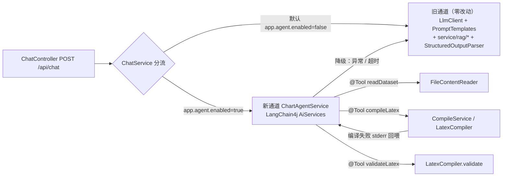

# LangChain4j 引入评估与落地方案（PGFPlotsGenerator）

> **本文档是自包含的决策与预案文档**：回答「本项目是否应当引入 LangChain4j」，并给出将来决定引入时的分阶段落地方案。执行者拿到本文档即可动工，无需回读 `plan-AI.md`。
> **项目**：PGFPlotsGenerator 后端（`hello/spring-backend/`，Spring Boot 3.2.12 + Java 17 + MyBatis-Plus 3.5.5 + MySQL）+ 前端（`hello/src/`，Vue 3.2 + Element Plus）。
> **前置**：批次1（A1 RAG + A2 Prompt 版本化 + A3 结构化输出 + CLI）已完成并通过实测验收；批次2（G1 编译队列化 + G2 并发控制 + O1 耗时拆解）已产出施工图、尚未实施。
> **基线**：`spring-backend/verify.cmd` → `PASS=27 / FAIL=0 / WARN=0`（2026-09-13）。
> **日期**：2026-09-14
> **适用范围声明：本文档不改任何代码、不改 `pom.xml`、不修改任何既有文件（包括不修改批次1 施工图的「禁止引入 AI 框架」约束条目）。** 第二部分的落地方案是**预案**，仅在将来明确决定引入时执行。

---

## 0. 结论摘要（TL;DR）

| # | 问题 | 结论 |
|---|---|---|
| 1 | 现有 AI 链路是什么形态？ | 全部自研、零 AI 框架依赖：`client/LlmClient`（OpenAI 兼容调用）+ `util/PromptTemplates`（手写提示词）+ `service/rag/*`（MySQL 存向量 + 暴力余弦）+ `util/StructuredOutputParser`（JSON 优先 + 正则兜底）。 |
| 2 | LangChain4j 最贴合吗？ | 是。三形态中唯一同栈选项（Java 进程内）；LangChain（Python）需旁挂独立服务，LangChain.js 需复活已退役的 Node 侧。 |
| 3 | 能力重叠区该不该替换？ | **不应该**。P1–P6 六个原语项目已自研且逐行可解释，替换只换来「代码更少」，代价是黑盒 + 大型传递依赖 + 双通道维护。 |
| 4 | 有没有不可替代的能力？ | **有一条**：P7「模型驱动的工具调用 / 多步循环」项目完全没有对应物。这是引入 LangChain4j 唯一站得住的第一性理由。 |
| 5 | 那到底该不该引？ | **取决于目标**：路径 A（只补功能缺口）→ 自研 tool-calling 循环性价比更高；路径 B（含简历关键词 + 学框架）→ 采用**并存式最小接入**，新功能默认关闭。两路径结论见 §2.8。 |
| 6 | 落地怎么做？ | 只接管**新增**的 Agent 能力（编译自愈），`LlmClient` / `service/rag/*` 全部保留；开关 `app.agent.enabled` 默认 `false`，关闭时行为与现状逐字节等价。见 §3。 |
| 7 | 明确不做什么？ | 不替换自研 RAG、不引 pgvector/Milvus、不用 `DocumentSplitter`/`DocumentLoader`、不用 Starter 自动装配。见 §3.6。 |

**一句话**：LangChain4j 在本项目的价值**不在「替代已有自研」，而在「补齐缺失的工具调用/多步循环原语」**；因此正确姿势是并存式最小接入，而不是重写 AI 链路。

---

## 1. 硬性约束（先读，违反即返工）

1. **评估优先于实施**：本文档的 Part 1 是**可证伪的论证**，Part 2 是**预案**。在未明确决定引入前，禁止依照 Part 2 改动任何代码。
2. **不改既有约束**：批次1 施工图 §0 约束 #1（禁止 LangChain4j / Spring AI / pgvector）与 `plan-AI.md` §10（为 demo 强引框架列为不做项）**保持原样**。若将来决定引入，应先单独修订这两处约束，再执行 Part 2——不得「先改代码、后补文档」。
3. **默认关闭原则**：任何 LangChain4j 相关能力必须挂在独立开关（`app.agent.enabled`）之后，**默认 `false`**；关闭时系统行为、`verify.cmd` 结果、提示词内容与改造前**逐字节一致**。
4. **零破坏 / 静默降级**：Agent 通道的任何异常（未配置 / 超时 / 上游报错 / 工具失败）必须降级回既有链路或返回受控错误，**绝不允许阻断主生成流程**——与 `RagService` 现有降级策略一致。
5. **不替换自研**：`client/LlmClient`、`util/PromptTemplates`、`service/rag/*`、`util/StructuredOutputParser` **一律保留**，禁止用框架抽象替换（理由见 §2.6）。
6. **工具全部复用现有实现**：Agent 工具必须调用既有类（`FileContentReader` / `CompileService` / `LatexCompiler`），禁止另起一套 IO / 编译 / 校验实现。
7. **事实标注原则**：外部生态事实（LangChain4j 版本、Starter 与 Spring Boot 3.2.12 的兼容区间、依赖树体积）凡未经本机实测的，一律标注「**待验证**」，不作无依据断言。本文档中代码事实均取自本仓源码。
8. **回归口径**：一切「不回归」表述以 `spring-backend/verify.cmd` 的 `FAIL=0` 为准（当前基线 `PASS=27`）。

---

## 2. 第一部分：第一性原理评估

### 2.1 为什么必须用第一性原理，而不是「LangChain 能做什么」

「引入 LangChain」这类问题最常见的失败模式是**从工具的卖点出发**（LangChain 有 Chain、有 Agent、有 RAG、有 Memory……看起来什么都能做），于是结论永远是「应该引入」。这种论证不可证伪，也无法回答真正的决策问题。

第一性原理的做法相反：**先把现有系统还原到不可再分的原语，再问「哪一个原语是我们缺的」**。如果 LangChain4j 只是在已有的原语上提供更漂亮的包装，那它带来的是「代码更少」而非「能力更强」——而「代码更少」在本项目里是**负收益**（见 §2.6：自研代码是本项目面试叙事的核心资产）。

因此本章结构为：**拆原语（§2.2）→ 映射框架抽象（§2.3）→ 判定重叠区（§2.4）→ 定位不可替代区（§2.5）→ 量化取舍（§2.6）→ 证伪追问（§2.7）→ 分层结论（§2.8）**。

### 2.2 拆原语：把现有 AI 链路还原到不可再分

下表把「自然语言 → AI 生成 LaTeX → 编译 PDF」链路拆成 7 个原语。**P1–P6 均已存在且全部自研；P7 完全缺失。**

| 原语 | 定义（不可再分的职责） | 本项目落点（已核实源码） | 规模 |
|---|---|---|---|
| **P1 提示词组装** | 把「静态指令 + few-shot + 数据集内容 + 输出约定」拼成 system prompt | `util/PromptTemplates.java`（手写 SYSTEM_PROMPT + `VERSION="v1.1-rag"` + `STRUCTURED_OUTPUT_SUFFIX` + `NO_DATASET_SUFFIX`）；`ChatService.buildSystemPrompt` | 14.25 KB 提示词 + 组装逻辑约 40 行 |
| **P2 模型调用** | 发一次 OpenAI 兼容 `/chat/completions`，含超时 / 异常转译 / 降级链 | `client/LlmClient.java`；`ChatService.generateWithFallback`（主模型 → reasoning 兜底 → 结构化纠错重试 → 同模型重试 → 切另一模型） | 187 行 + 降级链约 40 行 |
| **P3 输出契约 / 解析** | 约束模型输出结构，并从自由文本中**可靠地**取出可用代码 | `util/StructuredOutputParser.java`（JSON 优先）；`util/ChartCodeExtractor.java`（围栏 + `tikzpicture` 兜底） | 2.13 KB + 1.45 KB |
| **P4 检索（RAG）** | embed 查询 → 取候选 → 相似度打分 → Top-k → 组装为 few-shot | `service/rag/`：`EmbeddingClient`、`VectorStore`、`Retriever`、`PromptComposer`、`RagService` | **约 400 行**（113+87+86+32+86+异常类） |
| **P5 状态记忆** | 多轮会话与生成历史的持久化 | `conversation_messages` / `generation_history` 表；`ChatService.persistConversation`、`saveGenerationHistory` | 复用 MyBatis-Plus，无额外抽象 |
| **P6 副作用编排** | 落库、落盘、异步索引、系统日志等非主返回值的编排 | `ChatService.saveGenerationHistory`；`util/SystemLogWriter`；`api_log`；`config/AsyncConfig` 的 `ragIndexExecutor` | 约 120 行 |
| **P7 工具调用 / 多步循环** | 模型**自主决定**调用本地工具、读取工具结果、再决策，直到任务完成 | **无任何对应实现**（现有链路是「一次请求 → 一次响应 → 事后纠错重试」，不存在模型驱动的工具选择） | 0 |

> **关键观察**：`generateWithFallback` 的重试链**看似像「多步」**，但它是**代码写死的固定分支**（失败 → 换提示词 → 换模型），**不存在模型对「下一步做什么」的决策**。这正是「重试」与「Agent」的本质分界——也是 P7 定义的核心。

### 2.3 映射：LangChain4j 抽象 ↔ 本项目原语

| LangChain4j 抽象 | 对应原语 | 本项目是否已有等价物 | 判定 |
|---|---|---|---|
| `ChatModel` / `StreamingChatModel` | P2 | ✅ `LlmClient` | 重叠 |
| `ChatMemory` / `MessageWindowChatMemory` | P5 | ✅ `conversation_messages` + `ConversationService` | 重叠 |
| `AiServices`（`@SystemMessage` / `@UserMessage` / `@MemoryId`） | P1 + P3 | ✅ `PromptTemplates` + `StructuredOutputParser` | 重叠 |
| `EmbeddingModel` | P4（向量化部分） | ✅ `EmbeddingClient` | 重叠 |
| `EmbeddingStore` | P4（存储部分） | ✅ `VectorStore`（MySQL `rag_vector`） | 重叠 |
| `ContentRetriever` / `RetrievalAugmentor` | P4（召回 + 注入） | ✅ `Retriever` + `PromptComposer` + `RagService` | 重叠 |
| `DocumentSplitter` / `DocumentLoader` | 文档切分与加载 | ❌ 无，但**不适用**：输入是结构化表格（xlsx/csv）+ 结构化历史，不是非结构化文档 | 不适用 |
| **`@Tool` / `ToolSpecification` / AiServices 工具循环** | **P7** | **❌ 无任何等价物** | **不可替代** |
| Guardrails（输入/输出护栏） | 横切关注点 | ❌ 无（提示词内有危险序列校验，但非模型层护栏） | 弱相关，可选 |
| MCP 支持 | 外部工具协议接入 | ❌ 无 | 本阶段不需要 |

**映射结论**：LangChain4j 的抽象与项目原语的对应关系是 **6 重叠 / 1 不适用 / 1 不可替代**。重叠区恰恰是项目投入最大、打磨最充分的部分；不可替代区恰恰是项目**一行都没有**的部分。

### 2.4 判定一：重叠区（P1–P6）——**不应替换**

把 P1–P6 交给 LangChain4j，收益与代价并不对称：

**能换来的**（收益）：
- 代码量减少（示例性收益：`EmbeddingClient` + `VectorStore` + `Retriever` 约 286 行，可收编为 `EmbeddingStore` + `ContentRetriever` 的配置）；
- 抽象的「标准化」——换成框架接口后，理论上更易被外部读者理解。

**必须付出的**（代价，且多为一次性不可逆成本）：
1. **黑盒**：`RetrievalAugmentor` 内部的打分、过滤、注入时序由框架决定，出问题时排查路径变长。而现有 `Retriever.topK` 的余弦、阈值、分区 Top-k 逻辑只有 20 行、完全可控。
2. **大型传递依赖**：LangChain4j 会带入 okhttp 等一批传递依赖（**待验证**：`mvn dependency:tree` 实际增量），与 Spring 6 `RestClient` 双 HTTP 栈并存。
3. **双通道维护**：模型配置（`AppProperties.Llm.Provider` × DeepSeek/Qwen）若同时存在「`LlmClient` 读一套、LangChain4j 读一套」，任何配置变更都要改两处——这是纯粹的负债。
4. **摧毁叙事资产**：本项目的面试叙事核心是「**不引框架、逐行可解释、知道什么时候不该上框架**」（`plan-AI.md` §5.1 方案③否决理由、§10「为 demo 强引框架」不做项、§12 面试话术）。替换自研 RAG 等于把这份资产换成「我用了 LangChain 的 `EmbeddingStore`」——**信息量净减少**。

**结论**：P1–P6 **不替换**。这不是「保守」，而是四条代价全部大于收益，且第 4 条与项目既定目标（面试叙事）直接冲突。

### 2.5 判定二：不可替代区（P7）——**唯一的第一性理由**

P7（模型驱动的工具调用 / 多步循环）是唯一「项目一行都没有、且框架直接提供」的能力。它的业务价值在本项目里是**具体且可演示**的：

> 现状：`ChatService` 生成 LaTeX 代码后，编译失败只能**把 stderr 返回给用户**（`CompileService` 抛错 → 前端弹窗展示）。**模型无从得知自己写的代码编译失败了**，也就无法自我修复。
> P7 补齐后：生成 → 编译 → **失败时把 XeLaTeX stderr 作为工具结果回喂模型** → 模型据此修改代码 → 再次编译，直到成功或用尽轮次。这是「生成质量」的真实提升，而非代码风格问题。

这个闭环**不可能靠增加一次固定重试实现**——因为「读到什么错误、该改哪里」是模型的判断，不是代码的分支。它同时满足：
- **真实功能缺口**（用户诉求之一）：现有系统确实没有；
- **可演示、可量化**（面试叙事）：可用「构造一个编译失败用例 → 自愈成功」作为前后对比；
- **不破坏任何既有资产**：作为新增通道存在，`RAG_ENABLED` / 既有链路零改动。

**因此：引入 LangChain4j 的第一性理由 = P7；若不需要 P7，则引入 LangChain4j 就没有理由。**

### 2.6 自研 vs 框架取舍表（四维量化）

针对 **P7**（因为 P1–P6 已判定不替换），把两条实现路线放在同一张表上对比：

| 维度 | 路线 ①：自研 P7（扩展 `LlmClient`） | 路线 ②：LangChain4j 接管 P7 |
|---|---|---|
| **新增代码量** | 约 **100–150 行**（见 §2.7 拆解） | 约 **30–60 行**业务代码 + 框架依赖 |
| **新增依赖** | **0** | `langchain4j` + `langchain4j-open-ai`（± Spring Starter）；**传递依赖数量与 jar 体积待验证** |
| **可解释性** | **高**：每一步（传 `tools` → 解析 `tool_calls` → 本地执行 → 回填 `messages`）都在本仓，可逐行讲 | **中**：工具循环由框架驱动，需额外理解 `AiServices` 代理机制与内部循环 |
| **维护成本** | 自维护，与现有 `LlmClient` 同栈同风格，无版本摩擦 | 跟随框架大版本演进；**Spring Boot 3.2.12 与 Starter 的兼容区间待验证**；与既有 `ObjectMapper`/`SecurityConfig` 的共存需确认 |
| **简历信号** | 「手写 tool-calling 循环」= 深度信号 | 「用 LangChain4j 做 Agent」= 关键词信号 |
| **与既有叙事一致性** | **完全一致**（延续「零新依赖、逐行可讲」） | **需要额外话术对冲**（见 §5.4） |

> **读表方法**：如果你关心的是**工程性价比**，四维里自研赢三（依赖、可解释性、一致性），框架只赢代码量；如果你关心的是**关键词命中**，框架赢在简历信号——而这恰恰是无法用工程指标衡量的维度，必须由目标决定（§2.8）。

### 2.7 证伪追问：P7「自研只要 100–150 行」站得住吗？

这是本评估最需要被质疑的断言。拆开验证——OpenAI 兼容协议下，tool-calling 循环的全部工作量是 5 步：

| 步骤 | 动作 | 复用现有代码 | 估算 |
|---|---|---|---|
| 1 | 请求体加 `tools`（JSON Schema 描述 3 个工具） | 在 `LlmClient.chat` 的 body 里加一个字段 | ~30 行（Schema 声明） |
| 2 | 解析响应中的 `tool_calls` | 复用现有 `objectMapper.readTree` 解析模式 | ~20 行 |
| 3 | 本地执行工具（`readDataset` / `compileLatex` / `validateLatex`） | **完全复用** `FileContentReader` / `CompileService` / `LatexCompiler` | ~30 行（分发） |
| 4 | 把工具结果作为 `role:"tool"` 消息回填 `messages`，再次调用 | 复用 `LlmClient.chat(provider, messages, ...)` 重载（**已存在**） | ~20 行 |
| 5 | 循环控制（最大轮次、超时、异常降级） | 参照 `generateWithFallback` 的降级写法 | ~30 行 |

**合计 ≈ 130 行**，且步骤 3–4 的复用度极高（`LlmClient` 已有 `chat(provider, List<Map<String,String>> messages, ...)` 重载，天然支持多轮 messages）。

**结论**：该断言**成立**。因此「非用 LangChain4j 不可」在技术上**不成立**——框架的价值是省下这约 130 行，以及提供一个行业通用名词。这也是为什么最终结论必须分层（§2.8），而不能给一刀切的「应该」或「不应该」。

> **反面提醒**：若目标里包含「学习主流框架 / 在简历上体现框架经验」，那么这 130 行的「省」本身就是目的——此时用工程指标（依赖、性能）去否决框架，是用错了尺子。

### 2.8 分层结论：路径 A / 路径 B

| | **路径 A：只补功能缺口** | **路径 B：兼顾简历关键词 + 学框架** |
|---|---|---|
| **适用条件** | 目标是「让生成质量真正提升」，且重视与既有叙事的一致性 | 目标同时包含「简历出现 LangChain 字样 / 系统学习框架」 |
| **做法** | 自研 P7：扩展 `LlmClient` 支持 `tools`，新增 `service/agent/ChartRepairAgent` 实现「编译失败 → stderr 回喂 → 修复」 | 并存式最小接入：新增 `service/agent/ChartAgentService` 用 LangChain4j `AiServices` + `@Tool`，**只接管新增能力**，开关默认关闭 |
| **P1–P6** | 完全不动 | 完全不动（**禁止替换**） |
| **新增依赖** | 0 | `langchain4j` + `langchain4j-open-ai`（± Starter） |
| **优点** | 零依赖、零版本风险、逐行可解释、与批次1/2 叙事无缝衔接 | 关键词命中、可学框架、仍保留自研叙事（可讲「框架 vs 自研的边界判断」） |
| **缺点** | 简历上不会出现「LangChain」字样 | 引入依赖与版本摩擦；需要 §5.4 的话术对冲 |
| **推荐度** | 若纯看工程 → **推荐** | 若含简历目标 → **推荐**（且是本文 Part 2 的方案） |

> **两路径不互斥**：可先走路径 A 把「编译自愈」能力做出来（证明价值），再走路径 B 把同一能力用框架重写一遍用于学习——但**不建议同时维护两套 P7**（双通道负债）。若要做路径 B，应让路径 B 的 `ChartAgentService` **取代**路径 A 的实现，而非并存。

**最终判定**：引入 LangChain4j 是**可行且低风险**的（同栈、Java 17 满足、只做增量），但**不是必需的**。是否引入应由「简历关键词」这一非工程目标决定；一旦决定引入，必须按 §3 的**并存式最小接入**执行。

## 3. 第二部分：落地方案（并存式最小接入，默认关闭）

> **前置提醒**：执行本部分前，必须先按 §1 约束 2 修订批次1 施工图约束 #1 与 `plan-AI.md` §10——否则属于「先改代码、后补文档」。本部分内容在未获明确决策前**不得实施**。

### 3.1 双通道架构

核心设计：**两条通道共用同一套工具实现，默认走旧通道，新通道是纯增量。**



**读图要点**：
- 旧通道在新通道开启时**仍然存在**（作为降级落点），不是被替换；
- 三个工具的落地实现**全部指向既有类**，无新 IO / 编译 / 校验实现；
- 编译失败的回边（stderr 回喂）就是 P7 的价值所在。

### 3.2 任务总表

| 任务 | 阶段 | 内容 | 主要落点 | 依赖 |
|---|---|---|---|---|
| **T0** | Phase 0 | 可行性 spike：依赖树测量 + 连通性验证 + 兼容区间确认 | `spring-backend/pom.xml`（临时）、`mvn dependency:tree` | — |
| **T1** | Phase 0 | Stop 门槛判定（通过则继续，否则退回路径 A 或终止） | 无（决策点，产出结论记录） | T0 |
| **T2** | Phase 1 | 配置层：`Agent` 嵌套类 + `application.yml` 节点 | `config/AppProperties.java`、`resources/application.yml` | T1 |
| **T3** | Phase 1 | 工具类：3 个 `@Tool` 方法，全部委托既有实现 | `service/agent/ChartAgentTools.java` [NEW] | T2 |
| **T4** | Phase 1 | Agent 门面：`AiServices` 装配 + 多步循环 + 降级 | `service/agent/ChartAgentService.java` [NEW] | T3 |
| **T5** | Phase 1 | 分流接入：`ChatService` 单点分流（开关关闭时零改动） | `service/ChatService.java` | T4 |
| **T6** | Phase 1 | 回归与自愈验证 + 文档回填 | `spring-backend/verify.cmd`、`docs/log.md` | T5 |
| **T7** | Phase 2 | （可选）AiServices 类型化返回替换 `StructuredOutputParser` | `service/agent/*`、保留正则兜底 | T5 |

**执行顺序即编号顺序；每个任务完成跑一次 `mvn -q -DskipTests compile`；Phase 1 结束跑一次 `scripts\build.cmd && scripts\verify.cmd`。**

### 3.3 Phase 0：可行性 spike（产物可丢弃）

**目的**：在写任何业务代码前，用最小成本验证三个外部假设。**本阶段允许临时改 `pom.xml` 并随时回滚。**

| # | 验证项 | 方法 | 通过标准 |
|---|---|---|---|
| 1 | Starter 兼容性 | 加 `langchain4j-open-ai`（先不加 Starter）后 `mvn -q -DskipTests compile` | 编译通过；若引 Starter 则需确认其支持的 Spring Boot 主版本与 **3.2.12** 兼容 |
| 2 | 依赖膨胀量化 | `mvn dependency:tree > dep-before.txt`（加依赖前）与 `dep-after.txt`（加依赖后）对比 | 记录新增依赖**条目数**与新增 jar **体积**，写入本文档 §6 |
| 3 | 自定义 baseUrl 连通 | 用 `OpenAiChatModel.builder().baseUrl(...)` 分别指向 DeepSeek 与 NSCC Qwen 各发一次请求 | 两者均返回非空 content（Qwen 需确认 `chat_template_kwargs` 关思考参数是否可透传；**若不能透传，Qwen 侧不可用**） |

**T1 Stop 门槛（任一命中即停止引入）**：
- Starter 与 Spring Boot 3.2.12 存在**不可绕过**的冲突；
- 新增依赖条目数 / 体积超出可接受范围（建议阈值：新增 jar 总体积 > 项目现有依赖体积的 50%，具体由决策者定）；
- Qwen 侧无法关闭深度思考导致耗时不可接受（现有 `LlmClient` 已实测「只有 `chat_template_kwargs` 生效」，若框架无法透传该参数，则 Agent 通道只能单模型可用）。

**若命中 Stop 门槛**：退回**路径 A**（自研 tool-calling 循环，见 §2.6/§2.7），不建议强行引入。

### 3.4 Phase 1：最小接入「编译自愈 Agent」

#### 3.4.1 T2：配置层

`config/AppProperties.java` [MODIFY] 新增嵌套类（对齐现有 `@Data` + 默认值风格）：

```java
/** [Agent] LangChain4j 编译自愈 Agent 配置：默认关闭，关闭时行为与现状逐字节一致 */
@Data
public static class Agent {
    /** 总开关：false 时 ChatService 完全走旧链路，不加载任何 Agent Bean */
    private boolean enabled = false;
    /** 单次对话内工具调用最大轮次（防死循环） */
    private int maxIterations = 4;
    /** Agent 通道整体超时（毫秒），超时降级回旧链路 */
    private long timeoutMs = 120000L;
}
```

顶层新增 `private Agent agent = new Agent();`。

`resources/application.yml` [MODIFY]，追加在 `app.embedding` 之后：

```yaml
  agent:
    enabled: ${AGENT_ENABLED:false}
    max-iterations: ${AGENT_MAX_ITERATIONS:4}
    timeout-ms: ${AGENT_TIMEOUT_MS:120000}
```

#### 3.4.2 T3：工具类（全部复用既有实现）

`service/agent/ChartAgentTools.java` [NEW]，三个工具方法：

| 工具 | 签名意图 | 复用落点 | 注意 |
|---|---|---|---|
| `readDataset(dataId)` | 读取指定数据集文本内容 | `util/FileContentReader.read(...)` + `DataFileMapper`（归属校验 `eq(userId)`） | **必须带 `user_id` 归属校验**，防止越权读他人数据集 |
| `compileLatex(code)` | 编译 LaTeX 代码，返回成功/失败与 stderr | `service/CompileService` / `util/LatexCompiler` | **兼容批次2**：批次2 后编译为异步任务契约（`POST /api/compile/{hid}` 返回 `{task_id,status:"queued"}` + `GET /api/compile/task/{taskId}`）。工具层**不得假定编译同步返回**——应直接调用 `CompileService` 的内部方法或 `LatexCompiler`，而非假定 HTTP 契约 |
| `validateLatex(code)` | 编译前危险序列校验 | `util/LatexCompiler.validate(code, maxCodeLength)` | 是 `compileLatex` 的廉价前置，减少无效编译 |

> **约束**：工具方法必须**只做委托**，不含业务判断；所有异常在工具内捕获并转为**可读文本**返回给模型（工具抛异常会中断 Agent 循环）。

#### 3.4.3 T4：Agent 门面

`service/agent/ChartAgentService.java` [NEW]，职责：

1. 用 `AiServices` 绑定 `ChatModel`（`OpenAiChatModel` + DeepSeek `baseUrl`/`apiKey`/`model`，取自现有 `AppProperties.Llm`）与 `ChartAgentTools`；
2. 系统提示词**复用** `PromptTemplates.SYSTEM_PROMPT`（保持图型规则一致），叠加 Agent 专用指令（「优先输出可编译代码；编译失败时读取 stderr 并修复」）；
3. 循环受 `maxIterations` 与 `timeoutMs` 双重约束；
4. **降级**：任何异常 / 超时 → 记录 `system_log` warning，**回退调用旧链路**（复用 `ChatService` 现有生成方法），绝不让请求失败。

#### 3.4.4 T5：分流接入（唯一改动点）

`service/ChatService.java` [MODIFY]：在 `generate` 入口按开关分流——

```java
// [Agent] 开关关闭（默认）时完全不进入新通道，行为与改造前逐字节一致
if (appProperties.getAgent().isEnabled()) {
    Map<String, Object> agentResult = chartAgentService.tryGenerate(userId, request);
    if (agentResult != null) {
        return agentResult;
    }
    // 返回 null 表示 Agent 通道降级，继续走下方旧链路
}
```

**其余逻辑一行不动**：`buildSystemPrompt`、`generateWithFallback`、`saveGenerationHistory`、`ragService` 接入点全部保持原样。

**自检（Phase 1 完成后）**：
1. `AGENT_ENABLED` 不设 → `verify.cmd` **FAIL=0**（当前基线 PASS=27），且 `ChatService` 走旧链路（日志中无 `[Agent]`）；
2. `AGENT_ENABLED=true` + 构造一个必然编译失败的图型要求 → Agent 通道读到 stderr 并修复，最终可编译（或达到 `maxIterations` 后受控返回）；
3. `AGENT_ENABLED=true` + 故意配错模型 key → 不报 5xx，降级回旧链路（`system_log` 有 `[Agent]` warning）。

### 3.5 Phase 2：可选增强（低优先、收益小）

- 用 `AiServices` 的**类型化返回**（返回 `record ChartResult(String chartType, String code, String summary)`）替代 `StructuredOutputParser` 的手写解析；
- **硬约束：必须保留正则兜底**（`ChartCodeExtractor`）——模型未按结构返回时仍能出码，延续批次1/A3 的「绝不因模型不听话而失败」原则；
- **建议**：若收益与 Phase 1 不成正比，**不做**。

### 3.6 明确不做的边界（防过度设计）

| 不做项 | 理由 |
|---|---|
| 用 `EmbeddingStore` / `ContentRetriever` 替换 `service/rag/*` | 自研 RAG 已达标（约 400 行、逐行可解释），替换属净倒退（§2.4） |
| 引入 pgvector / Milvus 等向量库 | 数据量千级、暴力余弦毫秒级；`plan-AI.md` §5.1 已否决（过度设计） |
| 使用 `DocumentSplitter` / `DocumentLoader` | 输入是结构化表格（xlsx/csv）+ 结构化历史，非非结构化文档，无切分需求 |
| 使用 LangChain4j Spring Boot Starter 自动装配 | 会与现有 `LlmClient` / `ObjectMapper` / `SecurityConfig` 配置产生双重来源，破坏「配置单一来源」原则 |
| 用 LangChain4j 替换 `LlmClient` | 保留自研调用层作为唯一下游出口；框架只用于 P7 |
| 修改批次1 约束条目本身 | 约束修订是**独立决策**，不在本方案内顺带执行 |

## 4. 验收与回滚

### 4.1 验收清单（全部通过才算 Phase 1 完成）

| # | 验收项 | 方法 | 通过标准 |
|---|---|---|---|
| 1 | 基线不回归（**最重要**） | `AGENT_ENABLED` 不设，跑 `scripts\build.cmd && scripts\verify.cmd` | `FAIL=0`（当前基线 `PASS=27`）；无 `[Agent]` 日志 |
| 2 | 开关关闭时逐字节等价 | 关闭开关，抓 `buildSystemPrompt` 返回值与改造前对比 | 逐字符一致 |
| 3 | Agent 通道可用 | `AGENT_ENABLED=true`，发一条触发生成的消息 | 返回含 `code`；日志有 `[Agent]` 工具调用记录 |
| 4 | **编译自愈可复现**（核心价值验证） | 构造一次必然编译失败的用例，观察 Agent 是否读取 stderr 并修复 | 首轮失败 → 次轮成功；记录轮次与耗时 |
| 5 | 工具越权防护 | 用用户 B 的 token 让 Agent `readDataset(用户A的dataId)` | 工具返回「无权限/不存在」，不泄露内容 |
| 6 | 降级不阻断 | `AGENT_ENABLED=true` + 模型 key 配错 | 无 5xx；`system_log` 有 `[Agent]` warning；请求成功（走旧链路） |
| 7 | 死循环防护 | 构造模型永远修不好的用例 | 达到 `maxIterations` 后受控返回，不无限循环 |
| 8 | 依赖成本留痕 | Phase 0 的 `dep-before.txt` / `dep-after.txt` | 新增条目数与体积已写入 §6 |

### 4.2 回滚路径

引入 LangChain4j 的**全部改动都是可逆的**，且默认不生效：

| 层级 | 回滚动作 | 影响 |
|---|---|---|
| **运行时（零成本）** | `AGENT_ENABLED=false`（或删除该环境变量） | 立即回到旧链路，无需重启以外的任何操作（默认值即 `false`） |
| **代码层** | 删除 `service/agent/` 两个新类 + `ChatService` 分流段 + `AppProperties.Agent` | 无残留（新增类均为独立文件） |
| **依赖层** | `pom.xml` 删除 `langchain4j` / `langchain4j-open-ai` | 依赖树回到现状 |
| **数据库** | **无需回滚**（本方案不新增任何表 / 列） | — |

> **设计意图**：把「引入框架」的风险全部收敛到**新增文件 + 一个开关**，从而让「试试看」的成本被压到最低——这也是本方案敢建议路径 B 的前提。

---

## 5. 风险与对冲话术

| # | 风险 | 说明 | 对冲措施 |
|---|---|---|---|
| 1 | **版本摩擦** | `langchain4j-spring-boot-starter` 对 Spring Boot 主版本有要求，本项目为 `3.2.12` | Phase 0 T0 先验证；**优先只用 `langchain4j` + `langchain4j-open-ai` 两个库、不用 Starter**（§3.6） |
| 2 | **依赖膨胀** | 会带入 okhttp 等传递依赖，与 Spring 6 `RestClient` 双 HTTP 栈 | Phase 0 量化留痕（§6）；体积超阈值即触发 Stop 门槛 |
| 3 | **双通道维护** | 新老两套模型配置/提示词可能漂移 | 明确边界：框架**只用于 P7**，`LlmClient` 仍为唯一下游出口；提示词复用 `PromptTemplates.SYSTEM_PROMPT`，不另起一份 |
| 4 | **Jackson / Security 共存** | 框架自带 `ObjectMapper` / 配置可能与现有冲突 | 不用 Starter 自动装配；框架实例在 `ChartAgentService` 内手工 `builder()` 构造，不注册为全局 Bean |
| 5 | **Qwen 不可用** | 关思考依赖 `chat_template_kwargs`，框架可能不透传 | Phase 0 验证；若不可透传则 Agent 通道**仅 DeepSeek 可用**（现有降级链仍覆盖 Qwen） |
| 6 | **面试叙事自相矛盾**（最需警惕） | 批次1 明确写「禁止引入框架」、`plan-AI.md` §10 把「为 demo 强引框架」列为不做项，§12 话术是「不引框架是加分点」 | 见 §5.4 统一话术 |

### 5.4 面试叙事的统一话术（关键）

**矛盾点**：一边讲「我知道什么时候不该上框架（自研 RAG 约 400 行、逐行可解释）」，一边引入 LangChain4j，看起来是自我打脸。

**统一口径**（三句话，逻辑自洽）：
1. **边界**：「我把 AI 链路拆成 7 个原语，**6 个自研、1 个（工具调用/多步循环）用框架**。自研是因为那 6 个我需要逐行可控，且数据量压在暴力余弦毫秒级；用框架是因为 Agent 的工具循环是它的成熟能力，我不重复造。」
2. **默认关闭**：「框架能力挂在开关后面，**默认关闭**，关闭时回归测试 27 项全绿、提示词逐字节一致——所以它不构成对既有系统的风险。」
3. **演进观**：「这跟我不上 pgvector 是同一个判断标准——**看能力缺口和数据规模，不看框架热度**。数据量到万级我换向量库，接口不变；工具调用能力缺失我用框架补，边界清晰。」

> **一句话**：把「不引框架」和「用框架」都说成**同一个判断标准的不同应用**（缺什么补什么、按规模选方案），而不是两个互相否定的立场。

---

## 6. 待验证清单（实施前必须复核，届时回填本节）

| # | 待验证项 | 验证方式 | 状态 |
|---|---|---|---|
| 1 | LangChain4j 具体版本号 | 以 Maven Central 最新稳定版为准（检索时 1.13.0 于 2026-04 发布，其后有 1.19.0 等；**以实施当日为准**） | ⏳ 待验证 |
| 2 | `langchain4j-spring-boot-starter` 与 Spring Boot **3.2.12** 的兼容区间 | 查 Starter 的 POM 中 spring-boot 依赖版本 + 实际编译启动验证 | ⏳ 待验证 |
| 3 | 新增传递依赖**条目数** | `mvn dependency:tree` 前后对比 | ⏳ 待验证 |
| 4 | 新增 jar **体积** | 对比 `~/.m2` 中新增 jar 总大小 | ⏳ 待验证 |
| 5 | `OpenAiChatModel` 自定义 `baseUrl` 连通 DeepSeek | Phase 0 实测 | ⏳ 待验证 |
| 6 | `OpenAiChatModel` 连通 NSCC Qwen 且能透传关思考参数 | Phase 0 实测（重点） | ⏳ 待验证 |
| 7 | `AiServices` 工具循环的最大轮次是否可配置 | 查框架 API（`maxSequentialToolsInvocations` 等参数名以实施版本为准） | ⏳ 待验证 |
| 8 | 框架使用的最低 JDK 版本 | 查其 POM；项目 `java.version=17`、构建用 JDK 21 | ⏳ 待验证 |

---

## 附录：本文档与既有文档的关系

| 本文档章节 | 关联文档 | 关系 |
|---|---|---|
| §1 约束 2 | `plan-AI-批次1-执行方案.md` §0 约束 #1、`plan-AI.md` §10 | **本方案不修改它们**；若决定引入，须先独立修订这两处 |
| §2.4 / §2.6 | `plan-AI.md` §5.1（三方案对比，否决 Spring AI/LangChain4j）、§10、§12 | 本方案**认同**既有否决逻辑（重叠区不替换），并补充「不可替代区在 P7」的新论据 |
| §3.4.2 工具层 | `plan-AI-批次2-执行方案.md` §5（G1 编译异步契约） | Agent 工具**不得假定编译同步**；批次2 后编译为 `{task_id,status}` + 轮询 |
| §3.4 / §4 | `plan-AI.md` §4 批次表 | 本方案若实施，应作为**批次 5（体验与进阶）之外的独立批次**记录 |
| §4.1 验收 1 | `spring-backend/verify.cmd` | 一切「不回归」以 `FAIL=0` 为准（当前 `PASS=27`） |

**文档状态**：评估与预案已完备，**未执行**。后续若决定引入，请先完成 §6 待验证清单，再按 §3 编号顺序施工。

---

**文档版本**：v1.0
**日期**：2026-09-14
**基准**：`hello/spring-backend/` 下实际源码（批次1 完成态、批次2 施工图态）

